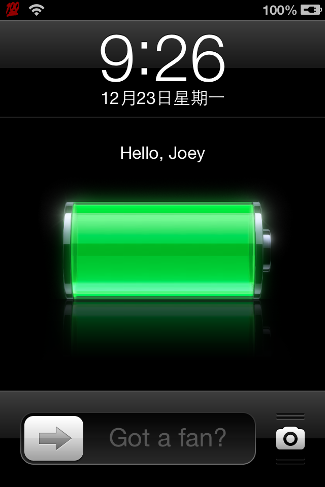

theos_demo
==========
A very simple demo to study MobileSubstrate

What it does is just show a label with text "Hello, Joey!" in the locked screen. You can replace the text with you matto and custom its style of your own , it must be very cool.  It's something naive and basic, but if you r a newbie to MobileSubstrate, you'll like it.

